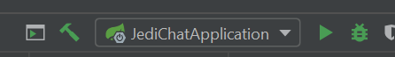

# Jedi-Chat Backend
Das ist das Backend für die [Angular Academy](https://github.com/angular-academy). Es wird parallel zum Kurs weiterentwickelt.

## Ihr braucht
Aktuell wird nur das [JDK 8](https://www.oracle.com/technetwork/java/javase/downloads/jdk8-downloads-2133151.html) benötigt.

## Setup
Es gibt 2 Möglichkeiten, wie ihr das Projekt lokal starten könnt.

### 1. IntelliJ Idea
Wenn ihr das Projekt mit IntelliJ öffnet erscheint nachdem IntelliJ fertig mit indizieren ist eine einfache Startkonfiguration. Diese könnt ihr einfach klicken und das wars.



### 2. Kommandozeile

Im Root-Verzeichnis des Projekts könnt ihr über die Kommandozeile mit dem Gradle-Wrapper das Projekt starten. Hier nicht verwirren lassen dass der Prozess bei 75% hängt, das beudetet dass die Anwendung läuft, man kommt auch nicht über die 75% hinaus.
```sh
./gradlew bootRun
```

## Betrieb

Wenn ihr die Anwendung erfolgreich gestartet habt ist sie unter [localhost:8080](http://localhost:8080/) erreichbar.
Aktuell gibt es 2 Default-Benutzer, einen Admin und einen normalen User.
Die Daten sind: 

**admin; admin**

**user; user**

Aktuell ist eine Authentifizierung nicht erforderlich, aber möglich.

## API
Aktuell bedient die API folgende Use-Cases für den Anfang:
- Neue Nutzer anlegen - PUT - (/registration)
- Nutzerprofile liefern - GET - (/api/user/__nickname__)
- Den aktuell eingeloggten Nutzer liefern - GET - (/api/user/)

Die gesamte API kann unter [localhost:8080/swagger-ui.html](http://localhost:8080/swagger-ui.html) eingesehen und gestet werden. Dort können auch die möglichen Werte für Enums unter Models eingesehen werden.